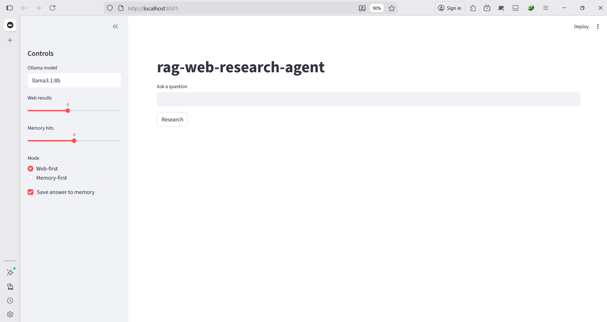
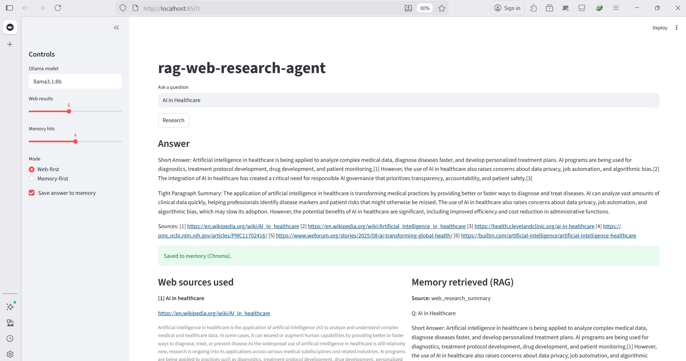
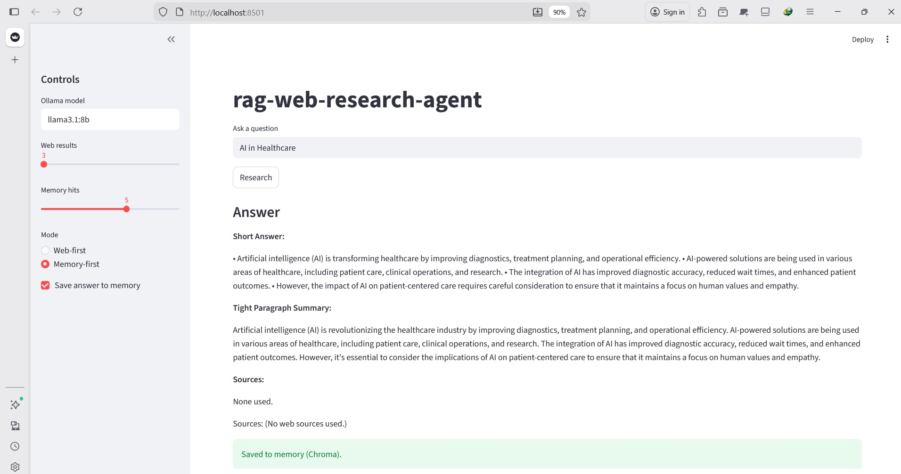

# RAG Web Research Agent (LangChain + Chroma + Streamlit)

A lightweight **RAG-powered web research assistant** that performs **real-time web search**, generates **clean summaries with inline citations**, and stores results into a **local vector database (Chroma)** for future retrieval (memory).

It’s designed as a **portfolio-grade demo** of agentic research workflows using a **local LLM (Ollama)** — meaning **no paid API key is required**.

---

## Features

- **Web Search (DuckDuckGo)**  
  Pulls top results with **title + snippet + link**

- **Cited Summaries**  
  Short Answer includes inline citations like **...[1] ...[2] ...[3]**

- **RAG Memory (ChromaDB)**
  - Saves summaries into a **persistent local vector database**
  - Retrieves similar past notes when a related question is asked

- **Two Modes**
  - **Web-first**: always search the web
  - **Memory-first**: only search the web when memory is weak

- **Streamlit UI Demo**
  - Clean layout
  - Sources panel + memory panel
  - Controls in sidebar (model, results, memory hits)

- **Link Sanitization**
  - Filters tracking/redirect URLs automatically
  - Avoids ugly `bing.com/aclick...` links in sources

---

## Technologies Used

- **Python**
- **Streamlit** (UI)
- **LangChain** (LLM interface + RAG glue)
- **Ollama** (local LLM runtime)
- **ChromaDB** (vector database)
- **SentenceTransformers embeddings** (`all-MiniLM-L6-v2`)
- **DuckDuckGo Search** (`ddgs`)

---

## Project Structure


```text
rag-web-research-agent/
│
├── app.py # Streamlit UI + LLM orchestration
├── rag_store.py # DuckDuckGo search tool wrapper
├── web_search.py # Chroma vector store (RAG memory)
├── requirements.txt
├── .env.example
├── README.md
├── .gitignore
├── LICENSE
└── screenshots/
    ├── 01-home.jpg
    ├── 02-prompt.jpg
    ├── 03-answer.jpg
    ├── 04-source-memory.jpg
    ├── 05-source-memory-1.jpg
    ├── 06-memory-only.jpg
    └── 07-updated-example.jpg
```

---

## How It Works (Architecture)

Step-by-step flow:

1. User enters a question in the Streamlit UI  
2. App retrieves similar memory notes from Chroma (**optional**)  
3. App searches the web via DuckDuckGo  
4. Sources + memory are injected into the prompt  
5. Ollama generates:
   - **Short Answer** (with citations)
   - **Tight Paragraph Summary** (no citations)
6. App appends a clean **Sources list**
7. Answer is optionally stored back into Chroma as memory

---

```mermaid
flowchart TD
    A[User Question] --> B[Streamlit UI]
    B --> C[Retrieve Memory (Chroma)]
    B --> D[Web Search (DuckDuckGo)]
    C --> E[Prompt Builder]
    D --> E[Prompt Builder]
    E --> F[Ollama LLM]
    F --> G[Answer + Citations]
    G --> H[Save to Chroma Memory]
```

## Setup (Windows + VS Code)

### 1) Clone

```bash
git clone https://github.com/Malachi216/rag-web-research-agent.git
cd rag-web-research-agent
```

### 2) Create and activate a virtual environment
```
py -3.10 -m venv .venv
.venv\Scripts\activate
```

### 3) Install dependencies
```
pip install -r requirements.txt
```

### 4) Install Ollama and pull a model

**Install Ollama:**
https://ollama.com/

Then pull a model:
```
ollama pull llama3.1:8b
```
###  5) Run the app
streamlit run app.py

**Example Prompts**

- How is AI being used in healthcare and what are the risks?

- Summarize the key challenges of deploying AI in emergency departments.

- What is RAG, and why do vector databases matter?

- Explain LangChain vs LangGraph in simple terms.

## Screenshots

### Main UI


### Answer + citations


### Using memory only


## Notes / Limitations

This project uses DuckDuckGo results, which may sometimes return weaker sources (blogs, Medium, marketing pages).

For stronger production-level research quality, replace the search backend with Tavily, SerpAPI, Bing Search API or Google Custom Search API

## Future Improvements

- Add PDF upload + citation-by-page (PDF RAG)

- Add Tavily search integration

- Add an export to markdown button

- Add chunk-level citations instead of source-level citations

**Deploy publicly via:**

- Streamlit Cloud

- HuggingFace Spaces

## Author

Olaoluwa Malachi
📧 olaoluwa.malachi@unb.ca

## License

This project is licensed under the MIT License.

